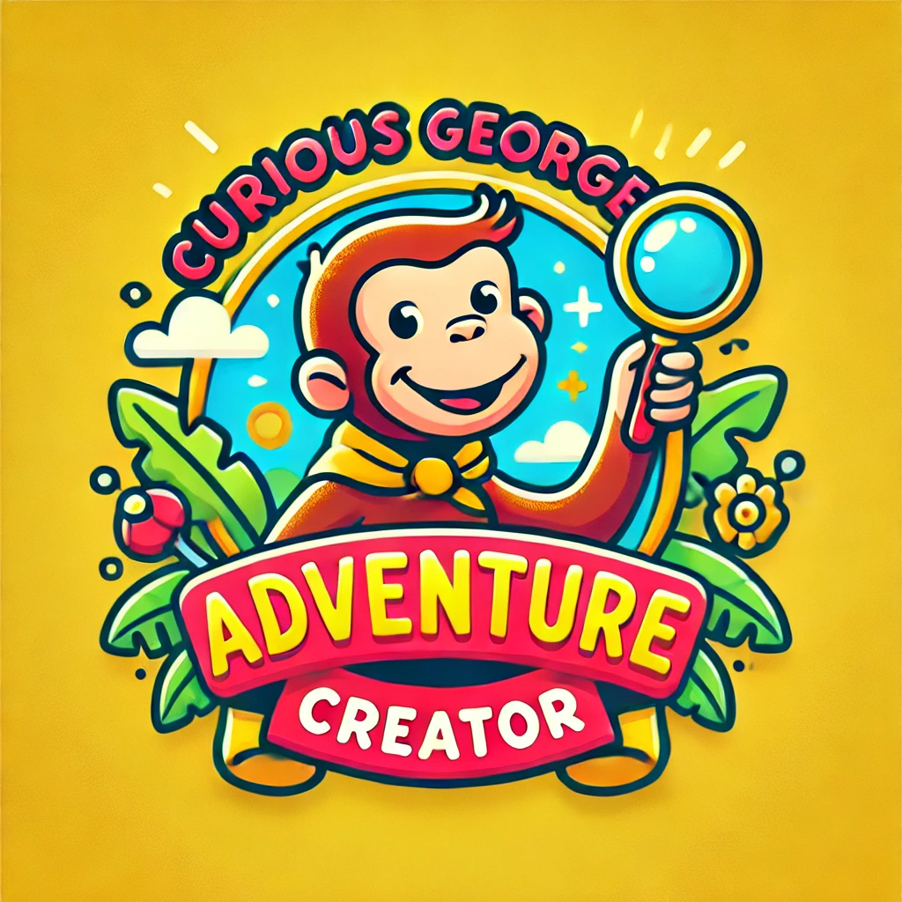
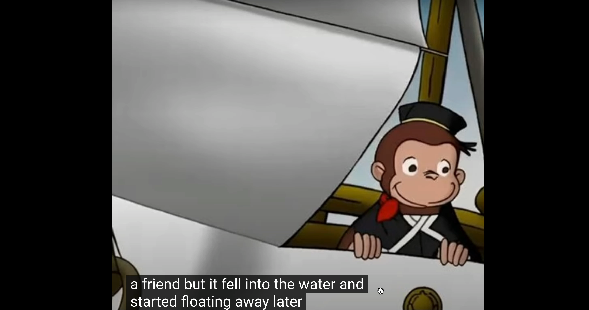
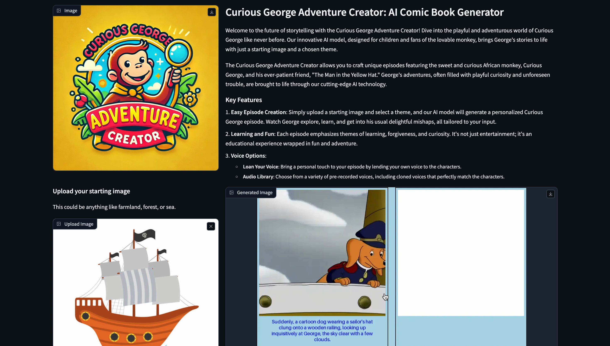

# Curious George Adventure Creator: AI Children's Book Generator



Welcome to the future of storytelling with the Curious George Adventure Creator! Dive into the playful and adventurous world of Curious George like never before. Our innovative AI model, designed for children and fans of the lovable monkey, brings George's stories to life with just a starting image and a chosen theme.

---

<a href="https://www.youtube.com/watch?v=NOGUQAqq2Xc"></a>

*Here is a video demo of our Story generated and voice over by our App.*

---

## What is it?

The Curious George Adventure Creator allows you to craft unique episodes featuring the sweet and curious African monkey, Curious George, and his ever-patient friend, "The Man in the Yellow Hat." George's adventures, often filled with playful curiosity and unforeseen trouble, are brought to life through our cutting-edge AI technology.

### Key Features

1. **Easy Episode Creation**: Simply upload a starting image and select a theme, and our AI model will generate a personalized Curious George episode. Watch George explore, learn, and get into his usual delightful mishaps, all tailored to your input.
   
2. **Learning and Fun**: Each episode emphasizes themes of learning, forgiveness, and curiosity. It's not just entertainment; it's an educational experience wrapped in fun and adventure.

3. **Voice Options**: 
   - **Loan Your Voice**: Bring a personal touch to your episode by lending your own voice to the characters.
   - **Audio Library**: Choose from a variety of pre-recorded voices, including cloned voices that perfectly match the characters.

## Technical Aspects

### This project is developed using SEED-Story

[Seed-Story](https://github.com/TencentARC/SEED-Story) is a Multimodal Large Language Model (MLLM) capable of generating multimodal long stories consisting of rich and coherent narrative texts, along with images that are consistent in characters and style, based on [SEED-X](https://github.com/AILab-CVC/SEED-X). 

### How It Works

1. **Stage 1: Visual Tokenization & De-tokenization**
   - Pre-train an SD-XL-based de-tokenizer to reconstruct images by taking the features of a pre-trained Vision Transformer (ViT) as inputs.

2. **Stage 2: Multimodal Sequence Training**
   - Sample an interleaved image-text sequence of a random length.
   - Train the MLLM by performing next-word prediction and image feature regression between the output hidden states of the learnable queries and ViT features of the target image.

3. **Stage 3: De-tokenizer Adaptation**
   - The regressed image features from the MLLM are fed into the de-tokenizer for tuning SD-XL, enhancing the consistency of the characters and styles in the generated images.

Given the same initial image but different opening texts, SEED-Story can generate different multimodal stories. For instance, starting with text referencing “the man in the yellow hat” will lead to images that include the character, while omitting this reference will result in a different narrative direction.

## Usage

### Dependencies
- Python >= 3.8 (Recommend to use [Anaconda](https://www.anaconda.com/download/#linux))
- [PyTorch >=2.0.1](Recommend to use torch==2.1.2+cu121)(https://pytorch.org/)
- GPU Vram > 40 GB

### Installation
Clone the repo and install dependent packages:

```bash
sudo apt-get update
sudo apt-get upgrade
git clone https://github.com/krishnaadithya/AIChildrensBookGen.git
cd AIChildrensBookGen
pip install --ignore-installed blinker
pip install -r requirements.txt
```

### Model Weights

```bash
curl -s https://packagecloud.io/install/repositories/github/git-lfs/script.deb.sh | bash
apt-get install git-lfs
#cd AIChildrensBookGen
cd pretrained
git clone https://huggingface.co/Qwen/Qwen-VL-Chat
git clone https://huggingface.co/TencentARC/SEED-Story
mv SEED-Story ./
git clone https://huggingface.co/stabilityai/stable-diffusion-xl-base-1.0
git clone https://krishnavadithya:<hf_token>@huggingface.co/meta-llama/Llama-2-7b-hf
cd ..
touch .project-root
```

Run the following script to reload the model:

```bash
python3 src/tools/reload_qwen_vit.py
```

### App

Experience the magic of Curious George's world like never before. Start creating your own episodes today and let your imagination soar!

Ready to embark on an adventure with Curious George?

```bash
python3 app.py
```

---

## Video Demo

<a href="https://www.youtube.com/watch?v=fICcwtiWK-g"></a>

*Here is a video demo of our App.*

---

### Based on:

```bash
@article{yang2024seedstory,
      title={SEED-Story: Multimodal Long Story Generation with Large Language Model}, 
      author={Shuai Yang and Yuying Ge and Yang Li and Yukang Chen and Yixiao Ge and Ying Shan and Yingcong Chen},
      year={2024},
      journal={arXiv preprint arXiv:2407.08683},
      url={https://arxiv.org/abs/2407.08683}, 
}
```
